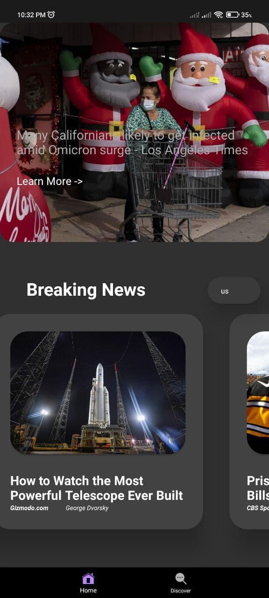

# News Application

This is a news application that uses an online API ([News API – Search News and Blog Articles on the Web](https://newsapi.org/)).

Here are some screen shots of this applications

This application is built in kotlin using mvvm architecture. Iam also using andorid architectural components like navigation graphs etc. New features are added incremently

# Attention

The api key that iam using have a limit of 100 requests/day.Given this project is opensource I suggest you to signup on the above provided website and generate you own api key and paste it in **seriousnewsapp\app\src\main\java\com\example\seriousnewsapp\api\NewsServiceApi.kt**** open this file and there is a variable at the top **const val API_KEY****. Replace your api key with the existing one and you will be good to go
